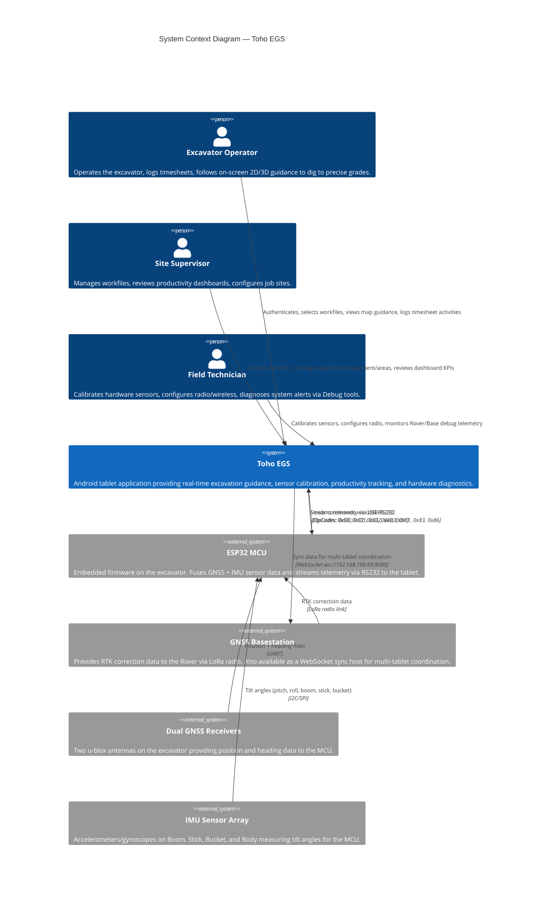

# Toho EGS — C4 Level 1: System Context Diagram

Shows the Toho EGS system as a single box and its interactions with all external actors and systems.

## Actors

| Actor | Role | Primary Interactions |
|-------|------|---------------------|
| **Excavator Operator** | Day-to-day user | Login, Map Guidance (Spot/Crumbling), Timesheet Start/Stop, Dashboard review |
| **Site Supervisor** | Management role | Workfile creation, Person/Equipment/Area CRUD, Dashboard productivity review |
| **Field Technician** | Hardware specialist | Calibration (Body/Boom/Stick/Bucket), Radio Config, Debug telemetry, Maintenance mode |

## External Systems

| System | Communication | Protocol |
|--------|--------------|----------|
| **ESP32 MCU** | USB RS232 (CP2102N) | Custom binary: `[55,AA,55,AA][Len][OpCode][Payload][CRC16]` |
| **GNSS Basestation** | LoRa Radio (to MCU) + WebSocket (to Tablet) | RTK corrections + JSON/binary sync |
| **Dual GNSS Receivers** | UART to MCU | u-blox UBX protocol |
| **IMU Sensor Array** | I2C/SPI to MCU | Raw accelerometer/gyroscope data |
