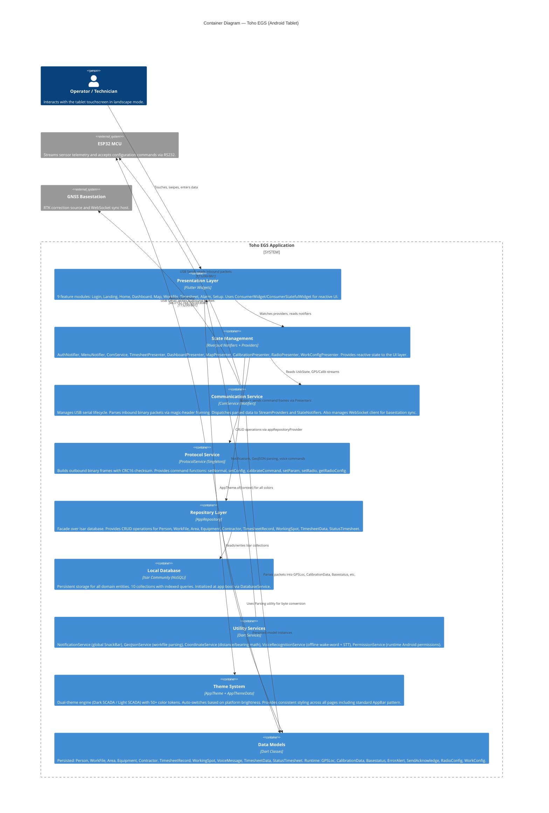

# Toho EGS — C4 Level 2: Container Diagram

Zooms into the Toho EGS system boundary, showing internal containers (layers/modules) and their interactions.



## Container Descriptions

### Presentation Layer
| Module | Path | Widget Type | Purpose |
|--------|------|-------------|---------|
| Login | `features/auth/` | `ConsumerStatefulWidget` | Operator authentication + mode selection |
| Landing | `features/landing/` | `ConsumerStatefulWidget` | Boot gatekeeper, session restore, USB auto-connect |
| Home | `features/home/` | `ConsumerStatefulWidget` | Master-detail shell with SideMenu + content area |
| Dashboard | `features/dashboard/` | `ConsumerWidget` | KPIs: production, productivity, precision, work hours |
| Map | `features/map/` | `ConsumerStatefulWidget` | Real-time MapLibre guidance (Spot/Crumbling modes) |
| Workfile | `features/workfile/` | `ConsumerWidget` | GeoJSON job file selection + creation |
| Timesheet | `features/timesheet/` | `ConsumerStatefulWidget` | Activity logging (ODT/MDT), shift tracking |
| Alarm | `features/alarm/` | `ConsumerWidget` | Voice command logs + system warning history |
| Setup | `features/setup/` | `StatelessWidget` | Grid gateway to 9 configuration sub-pages |

### State Management Layer
| Provider | Type | State | Purpose |
|----------|------|-------|---------|
| `authProvider` | `NotifierProvider` | `AuthState` | Current user, system mode, active workfile |
| `selectedMenuProvider` | `NotifierProvider` | `int` | Active SideMenu index (0-4) |
| `comServiceProvider` | `NotifierProvider` | `UsbState` | USB connection, devices, digging status, WebSocket |
| `gpsStreamProvider` | `StreamProvider` | `GPSLoc` | Live GNSS telemetry from 0xD0 |
| `calibStreamProvider` | `StreamProvider` | `CalibrationData` | Live calibration from 0xD1 |
| `bsProvider` | `NotifierProvider` | `Basestatus?` | Basestation health from 0xD3 |
| `errorProvider` | `NotifierProvider` | `List<ErrorAlert>` | Error buffer (max 100) from 0x83 |
| `radioProvider` | `NotifierProvider` | `RadioConfig?` | Radio settings from 0x86 |

### Communication Service
```
Inbound Pipeline:
  USB inputStream → .map() (liveness tracking, 500ms throttle)
    → Transaction.magicHeader([0x55, 0xAA, 0x55, 0xAA], maxLen: 200)
    → OpCode dispatch (packet[5])
    → Parser → Provider/StreamController

Outbound Pipeline:
  Presenter → ProtocolService.buildFrame(opcode, payload)
    → [Header][Length][OpCode][Payload][CRC16_LE]
    → port.write(Uint8List)
```

### Repository Layer
```
AppRepository (Singleton via Riverpod)
  ├── checkAndSeedDefaultUser()
  ├── getAllPersons() / watchPersons()
  ├── getAllWorkFiles() / watchWorkFiles()
  ├── getAllAreas() / getAllEquipment() / getAllContractors()
  ├── saveTimesheetRecord() / getTimesheetRecords()
  ├── saveWorkingSpot() / getWorkingSpots()
  └── deleteXxx() — cascading deletes where applicable
```

### Local Database
```
Isar Collections (10):
  ├── Person        (uid, firstName, lastName, kontraktor, role, password)
  ├── WorkFile      (name, equipment, geoJson, createdAt)
  ├── Area          (name, luasHa, targetDays)
  ├── Equipment     (name, model, type)
  ├── Contractor    (name, code)
  ├── TimesheetRecord (activity, startTime, endTime, duration, workspeed)
  ├── TimesheetData (category, activityName)
  ├── StatusTimesheet (status, description)
  ├── WorkingSpot   (lat, lng, status, spotID, workfileId)
  └── VoiceMessage  (text, timestamp, command)
```

### Theme System
```
AppTheme.of(context) → AppThemeData
  ├── Dark Mode  (SCADA Dark)  — 50+ tokens, hasGlowEffect: true
  ├── Light Mode (SCADA Light) — 50+ tokens, hasGlowEffect: false
  └── Auto-switch via MediaQuery.platformBrightness
```
