# Toho EGS — System Architecture

```mermaid
graph TB
    subgraph "External Systems"
        MCU["ESP32 / MCU<br/>(Firmware)"]
        GNSS1["GNSS Antenna 1<br/>(Rover)"]
        GNSS2["GNSS Antenna 2<br/>(Heading)"]
        IMU["IMU Sensors<br/>(Boom/Stick/Bucket)"]
        BS["Basestation<br/>(GNSS + Radio)"]
        LORA["LoRa Radio<br/>(E220 Module)"]
    end

    subgraph "Hardware Interface"
        USB["CP2102N<br/>USB-to-UART Bridge"]
        RS232["RS232 Serial<br/>115200 Baud / 8N1"]
    end

    subgraph "Android Tablet Application"
        direction TB

        subgraph "Presentation Layer"
            LOGIN["Login Page"]
            LANDING["Landing Page"]
            HOME["Home Page + SideMenu"]
            DASH["Dashboard"]
            MAP["Map Page<br/>(MapLibre)"]
            WF["Workfile Manager"]
            TS["Timesheet"]
            ALARM["Voice Logs / Alarm"]
            SETUP["Setup Gateway"]
        end

        subgraph "Setup Sub-Pages"
            CAL["Calibration<br/>(Body/Boom/Stick/Attach)"]
            RADIO["Radio Config"]
            WCONFIG["Work Config"]
            SYNC["Synchronize"]
            DEBUG["Debug<br/>(Rover/Base/Alert)"]
            WIRELESS["Wireless"]
            TESTING["Testing"]
            ABOUT["About Us"]
            MGMT["Management<br/>(CRUD)"]
        end

        subgraph "Core Services Layer"
            COM["ComService<br/>(USB Read + Parse)"]
            PROTO["ProtocolService<br/>(USB Write + Frame)"]
            CRC["CRCCalculator"]
            PARSE["Parsing Utility<br/>(Little-Endian)"]
            NOTIF["NotificationService"]
            VOICE["VoiceRecognitionService"]
            COORD["CoordinateService"]
            GEO["GeoJsonService"]
            PERM["PermissionService"]
        end

        subgraph "State Management (Riverpod)"
            AUTH["AuthNotifier<br/>(authProvider)"]
            MENU["MenuNotifier<br/>(selectedMenuProvider)"]
            GPS_P["gpsStreamProvider"]
            CAL_P["calibStreamProvider"]
            BS_P["bsProvider"]
            ERR_P["errorProvider"]
            RADIO_P["radioProvider"]
            COM_P["comServiceProvider<br/>(UsbState)"]
        end

        subgraph "Data Layer"
            ISAR["Isar Community<br/>(Local NoSQL DB)"]
            REPO["AppRepository"]
            DB_SVC["DatabaseService"]
            VM_REPO["VoiceMessageRepository"]
        end

        subgraph "Data Models (Isar Collections)"
            M_PERSON["Person"]
            M_WF["WorkFile"]
            M_AREA["Area"]
            M_EQUIP["Equipment"]
            M_CONTR["Contractor"]
            M_TS_REC["TimesheetRecord"]
            M_TS_DATA["TimesheetData"]
            M_TS_STAT["StatusTimesheet"]
            M_SPOT["WorkingSpot"]
            M_VOICE["VoiceMessage"]
        end

        subgraph "Runtime Models (Non-Persisted)"
            M_GPS["GPSLoc"]
            M_CAL["CalibrationData"]
            M_BS["Basestatus"]
            M_ERR["ErrorAlert"]
            M_ACK["SendAcknowledge"]
            M_RADIO["RadioConfig"]
            M_WCONF["WorkConfig"]
        end

        subgraph "Theme System"
            THEME["AppTheme<br/>(Dark + Light)"]
            THEME_D["AppThemeData<br/>(50+ Tokens)"]
        end
    end

    subgraph "WebSocket Link"
        WS["WebSocket Client<br/>(ws://192.168.100.69:8080)"]
    end

    %% Hardware connections
    GNSS1 --> MCU
    GNSS2 --> MCU
    IMU --> MCU
    BS -- "Radio Correction" --> LORA
    LORA --> MCU
    MCU --> RS232
    RS232 --> USB

    %% USB to ComService
    USB -- "Inbound Packets<br/>(0xD0,0xD1,0xD2,0xD3,0x81,0x83,0x86)" --> COM
    COM -- "Magic Header Framing<br/>[0x55,0xAA,0x55,0xAA]" --> GPS_P
    COM --> CAL_P
    COM --> BS_P
    COM --> ERR_P
    COM --> RADIO_P

    %% ProtocolService outbound
    PROTO -- "Outbound Frames<br/>(0x50,0x52,0x53,0x0B,0x0C)" --> USB
    PROTO --> CRC
    PROTO --> PARSE

    %% WebSocket
    COM --> WS
    WS -- "JSON / Raw Bytes" --> BS

    %% Presentation to State
    LOGIN --> AUTH
    LANDING --> AUTH
    HOME --> MENU
    DASH --> GPS_P
    MAP --> GPS_P
    MAP --> COM_P

    %% Setup sub-pages
    SETUP --> CAL
    SETUP --> RADIO
    SETUP --> WCONFIG
    SETUP --> SYNC
    SETUP --> DEBUG
    SETUP --> WIRELESS
    SETUP --> TESTING
    SETUP --> ABOUT
    SETUP --> MGMT
    CAL --> PROTO
    RADIO --> PROTO
    WCONFIG --> PROTO

    %% Data Layer
    REPO --> ISAR
    DB_SVC --> ISAR
    VM_REPO --> ISAR
    REPO --> M_PERSON
    REPO --> M_WF
    REPO --> M_AREA
    REPO --> M_EQUIP
    REPO --> M_CONTR
    REPO --> M_TS_REC
    REPO --> M_SPOT

    %% Theme
    THEME --> THEME_D

    %% ComService parsed models
    COM --> M_GPS
    COM --> M_CAL
    COM --> M_BS
    COM --> M_ERR
    COM --> M_ACK
    COM --> M_RADIO
```



## Data Flow Summary

### Inbound (MCU → App)
```
MCU → RS232 → CP2102N → USB inputStream → ComService._startUsb()
  → Transaction.magicHeader [55,AA,55,AA] → OpCode Dispatch
    → 0xD0 → _parseGPSLoc()    → gpsStreamProvider
    → 0xD1 → _parseCalibData() → calibStreamProvider
    → 0xD2 → diggingStatus flag
    → 0xD3 → _parseBasestatus() → bsProvider
    → 0x81 → _parseSendAck()   → NotificationService
    → 0x83 → _parseErrorAlert() → errorProvider
    → 0x86 → _parseRadioConfig() → radioProvider
```

### Outbound (App → MCU)
```
UI Widget → Presenter → ProtocolService.buildFrame()
  → [Header(4)] [Length(1)] [OpCode(1)] [Payload(N)] [CRC16(2)]
  → port.write(Uint8List) → CP2102N → RS232 → MCU
    → 0x50 → setNormal/setConfig
    → 0x52 → calibrateCommand
    → 0x53 → setParam
    → 0x0B → setRadio
    → 0x0C → getRadioConfig
```
